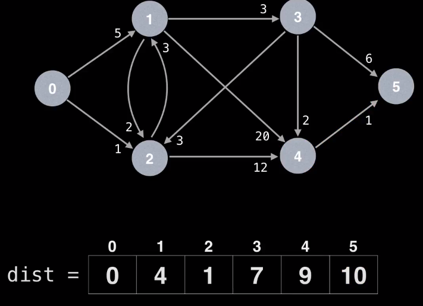

### Dijkstra's Algorithm
Two implementations of the Dijkstra's Algorithm. One computes the shortest
min_dist from start to all nodes, the other one computes the shortest path 
from start to end, end return the path. For the example here, we use the graph
provided in this youtube video:

<p align="center">

</p>   

First version, returns the shortest distances of all nodes to the starting point.
```python
def dijkstra(graph, n, start):
    # graph: adjacency list for O(1) access to neighbors
    # n: number of nodes
    # start: starting point of dijkstra algorithm

    # once we visit a node, we never visit again
    visited = set()
    
    # shortest distance of each node to start
    min_dist = [float("inf")] * n
    min_dist[start] = 0

    # use a heap to get the unvisited node that has shortest distance
    # heap element: (dist, node)
    heap = [(0, start)]

    # start dijkstra algorithm
    while heap:
        dist, node = heapq.heappop(heap)

        # Skip the stale shortest distances.
        # If the current distance > the distance in the table,
        # it means that the shortest distance of this node must have been processed.
        # Note that we need to use STRICT less than here,
        # when they are equal, the current node can be the one
        # that is in the "min_dist" table
        if min_dist[node] < dist: continue

        visited.add(node)

        for neighbor, weight in graph[node]:
            if neighbor in visited: continue
            new_dist = dist + weight 
            # perform edge relaxation,
            # this step here is called "lazy implementation",
            # because we are not updating the heap, we are
            # inserting new value into the heap, and skip
            # the stale value in the future.
            # To implement "eager Dijkstra", we need indexed priority queue.
            if new_dist < min_dist[neighbor]:
                min_dist[neighbor] = new_dist
                heapq.heappush(heap, (new_dist, neighbor))

    return min_dist
```
Testing:
```python
# min_dist from 0 to all the points
min_dist = dijkstra(graph, n, start=0)
print(min_dist)
```
out:
```
[0, 4, 1, 7, 9, 10]
```

Second version, returns the shortest path from start to end.
```python
def dijkstra_path(graph, n, start, end):
    # return the shortest path and length from start to end

    visited = set()
    min_dist = [float("inf")] * n
    min_dist[start] = 0
    prev = [None] * n
    heap = [(0, start)]
    
    while heap:
        dist, node = heapq.heappop(heap)

        if min_dist[node] < dist: continue

        visited.add(node)

        for neighbor, weight in graph[node]:
            if neighbor in visited: continue
            new_dist = dist + weight
            if new_dist < min_dist[neighbor]:
                min_dist[neighbor] = new_dist
                heapq.heappush(heap, (new_dist, neighbor))
                prev[neighbor] = node

    # construct the path from end to start
    path = [end]
    p = end
    # prev[start] is None
    while prev[p]:
        path.append(prev[p])
        p = prev[p]
    path.append(start)
    return list(reversed(path)), min_dist[end]
```

Testing:
```python
# find path
path, path_len = dijkstra_path(graph, n, start=0, end=5)
print(path)
print(path_len)
```
out:
```
[0, 2, 1, 3, 4, 5]
10
```
